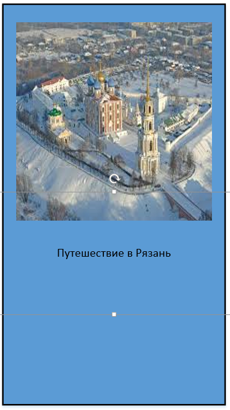
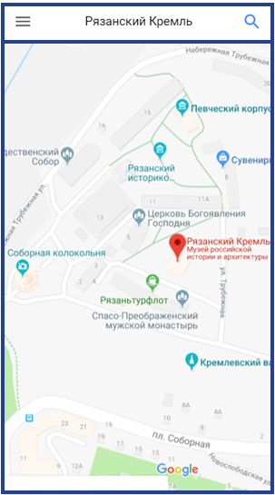
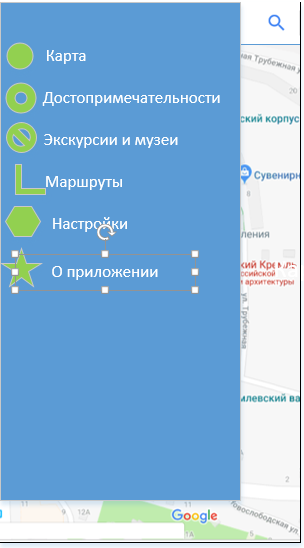
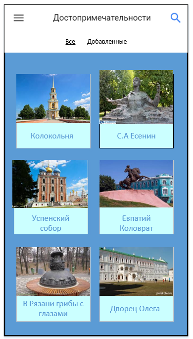
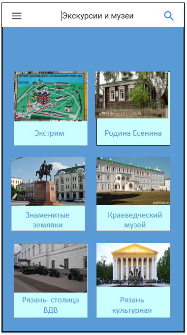
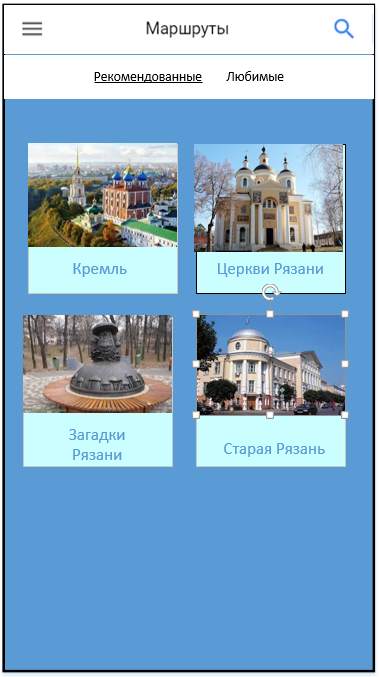
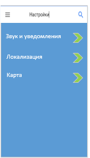

# КОНЦЕПЦИЯ МОБИЛЬНОГО ПРИЛОЖЕНИЯ "РЯЗАНСКИЙ КРЕМЛЬ"

## 1 ВВЕДЕНИЕ 
### 1.1 ЦЕЛЬ

Описать общее видение приложения и его основное назначение идеи и концепцию интерфейса.

### 1.2 НАЗНАЧЕНИЕ ПРОДУКТА

Приложение предназначено для жителей и гостей города, желающих узнать больше о главных достопримечательностях и выдающихся людях Рязани. Приложение поможет найти интересные места (памятники, музеи, шедевры архитектуры), узнать интересные факты, построить удобные маршруты осмотра достопримечательностей.

### 1.3 ПРОТОТИПЫ И АНАЛОГИ ПРОДУКТА

Приложение Брестская крепость.

### 1.4 ПРЕДПОЛОЖЕНИЯ И ЗАВИСИМОСТИ
Описываемое решение является первым этапом разработки и может быт расширено дополнительными функциями в дальнейшем.

## 2 ВОЗМОЖНОСТИ ПРОДУКТА
### 2.1 ФУНКЦИИ ПРИЛОЖЕНИЯ
#### 2.1.1 Карта

* Просмотр карты исторической части Рязани (Кремль и окрестности). 
  * Масштабирование,
  * отображение основных достопримечательностей с различными  обозначениями (указатель с иконкой)
  * местоположение пользователя
  * маршрут (если построен)
* Просмотр информации о выбранном объекте
* Возможность добавить выбранный объект в маршрут

#### 2.1.2 Достопримечательности

* Просмотр списка достопримечательностей (вкладки с набором достопримечательностей в виде картинок)
* Просмотр карточки достопримечательности
  * Фото
  * Описание
  * Историческая фишка (старые фото (старые – новые фото одного и того же объекта)

#### 2.1.3 Маршруты

* Рекомендуемые маршруты + аудиоэкскурсии
* Пользовательские маршруты
  * Создание и изменение пользовательского маршрута
  * Старт и сопровождение по карте

#### 2.1.4 Экскурсии и музеи

* Экскурсии
* Сведения об экскурсиях (TBD)
* Музеи
* Список музеев в виде фото с названием.
* Для каждого музея можно посмотреть карточку на которой отображается 
  * несколько фото, 
  * краткое описание, 
  * основная информацию (режим работы, адрес, контакты)
  * отзывы (или рейтинг)
  * связанные достопримечательности

#### 2.1.5 Настройки

* Настройки системы
  * Звуки и уведомления
  * Локализация
  * Карта

### 2.2 ФОРМЫ ПОЛЬЗОВАТЕЛЬСКОГО ИНТЕРФЕЙСА

|                       |                                    |
|-----------------------|:----------------------------------:|
| Входная форма         |      |
| Карта                 |            |
| Карта + меню          |      |
| Достопримечательности |            |
| Экскурсии и музеи     |        |
| Маршруты              |      |
| Настройки             |  |
| О программе           |                                    |

